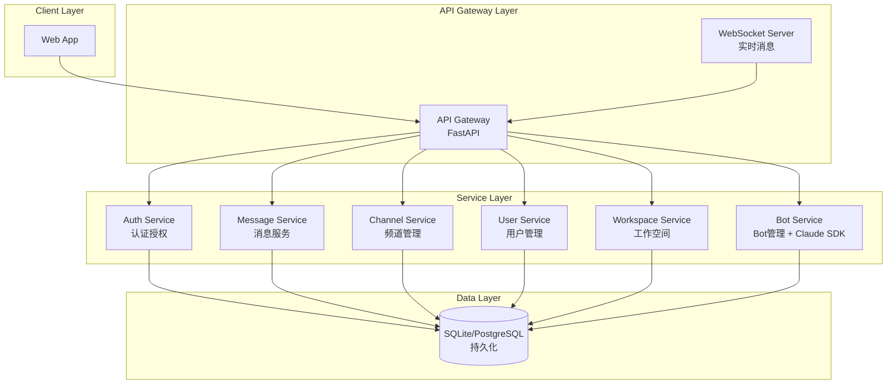
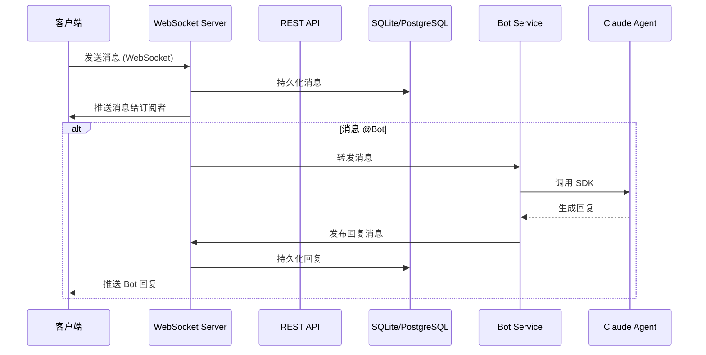

# Slack 风格聊天系统简化版实现计划

## 一、需求理解

**目标**: 实现一个简化版的 Slack 风格聊天系统
**约束条件**:
- 不使用 Redis、Elasticsearch、Kafka、K8s
- 需要接入 Bot，使用 Claude Agent SDK
- 考虑后期扩展性

---

## 二、技术架构建议

### 1. 技术栈选择

| 层级 | 技术选择 | 理由 |
|------|----------|------|
| **后端 API** | Python FastAPI | 高性能异步，与 Agent SDK 同语言好集成 |
| **WebSocket** | FastAPI + WebSocket | 统一技术栈，简化部署 |
| **数据库** | SQLite (开发) / PostgreSQL (生产) | 符合偏好，SQLite 免安装适合开发 |
| **前端** | React + TypeScript | 与文档一致 |
| **Bot SDK** | Claude Agent SDK | 用户指定 |
| **文件存储** | 本地文件系统 (开发) | 简化版不需要 S3 |

### 2. 简化版架构图



### 3. 消息流转 (简化版)



---

## 三、功能优先级

### MVP (第一阶段)

| 功能 | 描述 |
|------|------|
| 用户注册/登录 | JWT 认证 |
| 工作空间 | 创建、加入、列出 |
| 频道 | 创建、列表、加入 |
| 消息收发 | REST API + WebSocket |
| 私聊 DM | 点对点消息 |

### 第二阶段

| 功能 | 描述 |
|------|------|
| 消息回复/线程 | 消息嵌套回复 |
| 消息反应 | Emoji 反应 |
| Bot 接入 | Claude Agent SDK 集成 |

---

## 四、项目结构建议

```
anteam/
├── src/                    # 源代码
│   ├── api/               # API 路由
│   │   ├── auth.py
│   │   ├── workspace.py
│   │   ├── channel.py
│   │   ├── message.py
│   │   └── bot.py
│   ├── services/         # 业务逻辑
│   │   ├── auth.py
│   │   ├── workspace.py
│   │   ├── channel.py
│   │   ├── message.py
│   │   └── bot.py
│   ├── models/           # 数据模型 (SQLModel/Pydantic)
│   ├── db/               # 数据库
│   │   └── database.py
│   └── main.py           # 入口
├── web/                   # 前端 (React)
├── tests/                 # 测试
├── Makefile
└── requirements.txt
```

---

## 五、Bot 接入设计

### Claude Agent SDK 集成方式

```python
# Bot Service 核心逻辑
from anthropic import Anthropic

class BotService:
    def __init__(self, api_key: str):
        self.client = Anthropic(api_key=api_key)

    async def handle_mention(self, message: str, context: dict) -> str:
        response = self.client.messages.create(
            model="claude-sonnet-4-20250514",
            max_tokens=1024,
            messages=[{"role": "user", "content": message}]
        )
        return response.content[0].text
```

### Bot 事件处理

1. 用户在频道中 @Bot
2. WebSocket 检测到消息中的 @mention
3. 调用 Bot Service
4. Bot Service 调用 Claude Agent SDK
5. 返回回复消息到频道

---

## 六、数据库表设计 (简化版)

### 核心表

- `users` - 用户
- `workspaces` - 工作空间
- `workspace_members` - 工作空间成员
- `channels` - 频道
- `channel_members` - 频道成员
- `messages` - 消息 (支持 parent_id 实现线程)
- `bots` - Bot 配置

---

## 七、下一步

1. 确认技术架构是否合理
2. 使用 OpenSpec 创建变更
3. 开始实现 MVP 功能
